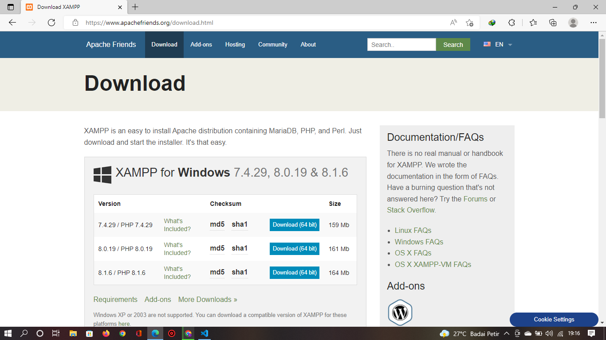
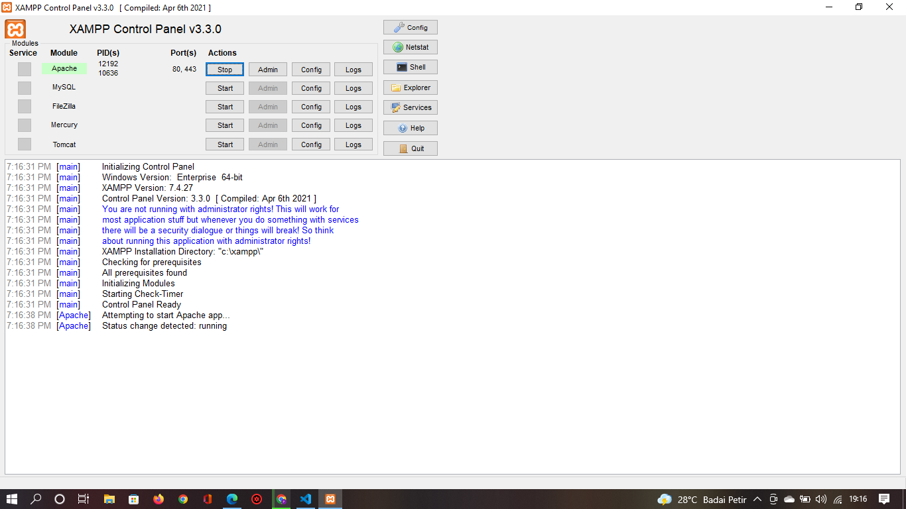

# Lab7Web

## Nama : Prananda Aditya

## Nim : 312010130

## Kelas : TI.20.A1

## Mata Kuliah : Pemograman Web

# langkah-langkah Praktikum

## 1. Download Xampp

  Unduh XAMPP dari https://www.apachefriends.org/download.html

## 2. Menjalankan Web Server

 Untuk menjalankan web server dari menu XAMPP Control

> Uji coba apakah server sudah bekerja dengan baik http://127.0.0.1 atau http://localhost
> Tampil halaman utama XAMPP jika server sudah bekerja dengan baik.
> Dokumen Website semua file website tempatkan di direktori:/xampp/htdocs/
> Database MySQL Direktori:/xampp/mysql
> Manajemen database: http://localhost/phpmyadmin
