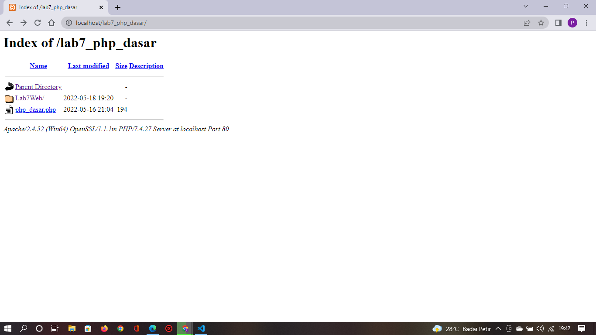
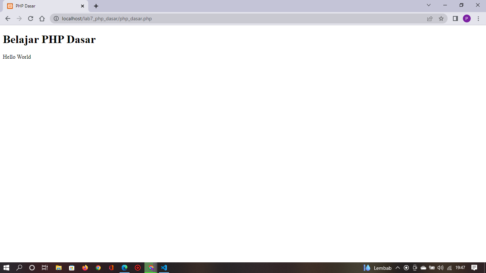
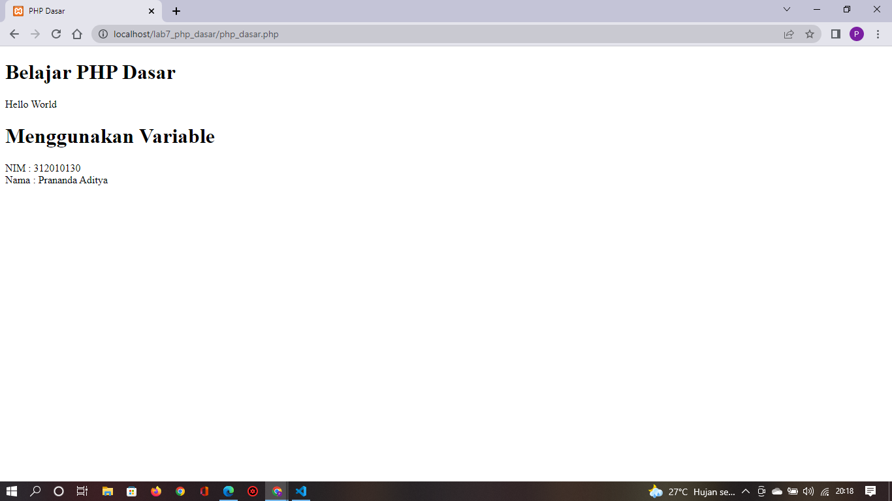
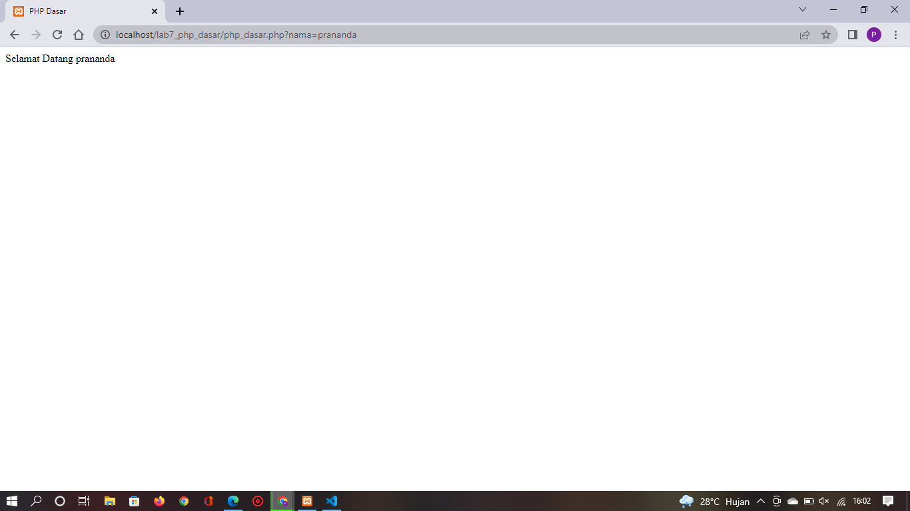
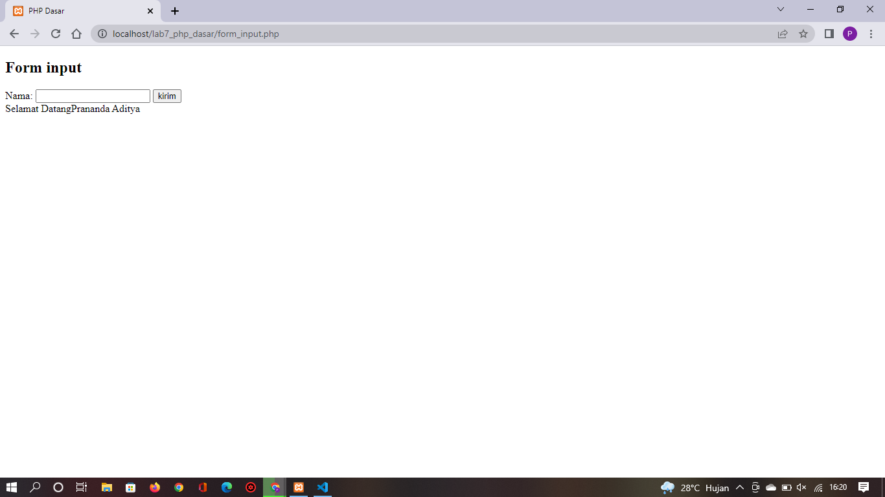

# Lab7Web

## Nama : Prananda Aditya

## Nim : 312010130

## Kelas : TI.20.A1

## Mata Kuliah : Pemograman Web

# langkah-langkah Praktikum

## 1. Download Xampp

<br> Unduh XAMPP dari https://www.apachefriends.org/download.html


## 2. Menjalankan Web Server

<br>Untuk menjalankan web server dari menu XAMPP Control


<br>> Uji coba apakah server sudah bekerja dengan baik http://127.0.0.1 atau http://localhost
<br>> Tampil halaman utama XAMPP jika server sudah bekerja dengan baik.
<br>> Dokumen Website semua file website tempatkan di direktori:/xampp/htdocs/
<br>> Database MySQL Direktori:/xampp/mysql
<br>> Manajemen database: http://localhost/phpmyadmin

## 3. Memulai PHP

<br>Buat Folder lab7_php_dasar pada root directory web server (/xampp/htdocs)

<br>Kemudian untuk mengakses direktory tersebut pada web server dengan mengakses URL: http://localhost/lab7_php_dasar/


## 4. PHP Dasar

<br>Buat file baru dengan nama php_dasar.php pada directory tersebut. kemudian buat kode seperti berikut.

```<!DOCTYPE html>

<html lang="en">
<head>
 <meta charset="UTF-8">
 <title>PHP Dasar</title>
</head>
<body>
 <h1>Belajar PHP Dasar</h1>
 <?php
 echo "Hello World";
 ?>
</body>
</html>
```

<br> Kemudian untuk mengakses hasilnya melalui URL: http://localhost/lab7_php_dasar/php_dasar.php


### Variable PHP

<br>Menambahkan variable pada program.

```<h1>Menggunakan Variable</h1>
<?php
$nim = "312010130";
$nama = 'Prananda Aditya';
echo "NIM : " . $nim . "<br>";
echo "Nama : $nama";
?>
```



### Predefine Variable

<br>Kodenya Seperti Berikut

```
<?php
echo 'Selamat Datang ' . $_GET['nama'];
?>
```

<br>Untuk Mengaksesnya gunakan URL:
http://localhost/lab7_php_dasar/php_dasar.php?nama=Prananda


## 5. Membuat Form Input

```
<!DOCTYPE html>
<html lang="en">
<head>
    <meta charset="UTF-8">
    <meta http-equiv="X-UA-Compatible" content="IE=edge">
    <meta name="viewport" content="width=device-width, initial-scale=1.0">
    <title>PHP Dasar</title>
</head>
<body>

<h2> Form input</h2>
<form method="post">
    <label>Nama: </label>
    <input type="text" name="nama">
    <input type="submit" value="kirim">
</form>
<?php
echo 'Selamat Datang' . $_POST['nama'];
?>

</body>
</html>
```



### Operator

```
<!DOCTYPE html>
<html lang="en">
<head>
    <meta charset="UTF-8">
    <meta http-equiv="X-UA-Compatible" content="IE=edge">
    <meta name="viewport" content="width=device-width, initial-scale=1.0">
    <title>PHP Dasar</title>
</head>
<body>

<h2>Operator</h2>
<?php
$gaji = 1000000;
$pajak = 0.1;
$thp = $gaji - ($gaji*$pajak);
echo "Gaji sebelum pajak = Rp. $gaji <br>";
echo "Gaji yang dibawa pulang = Rp. $thp";
?>

</body>
</html>
```


