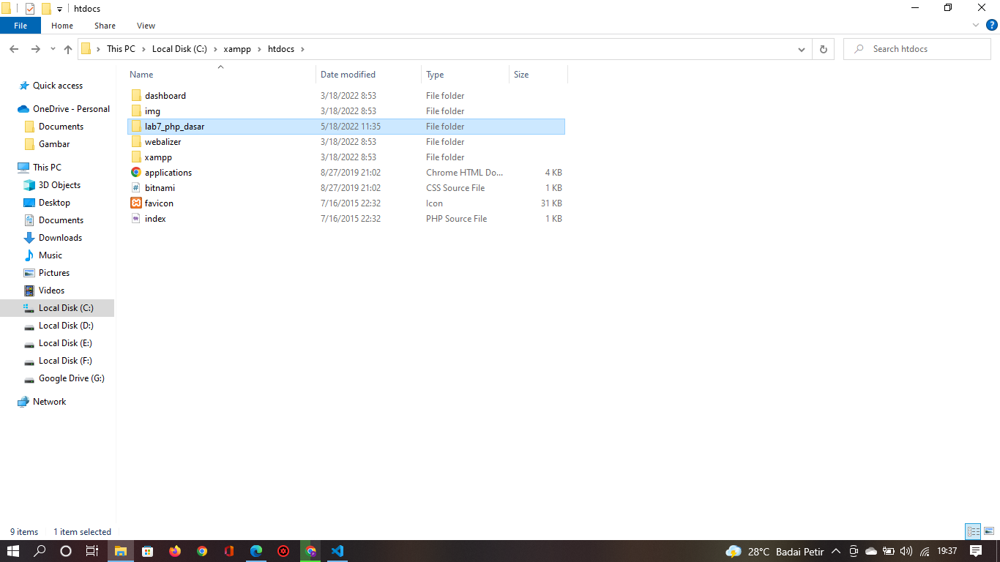

# Lab7Web

## Nama : Prananda Aditya

## Nim : 312010130

## Kelas : TI.20.A1

## Mata Kuliah : Pemograman Web

# langkah-langkah Praktikum

## 1. Download Xampp

<br> Unduh XAMPP dari https://www.apachefriends.org/download.html


## 2. Menjalankan Web Server

<br>Untuk menjalankan web server dari menu XAMPP Control


<br>> Uji coba apakah server sudah bekerja dengan baik http://127.0.0.1 atau http://localhost
<br>> Tampil halaman utama XAMPP jika server sudah bekerja dengan baik.
<br>> Dokumen Website semua file website tempatkan di direktori:/xampp/htdocs/
<br>> Database MySQL Direktori:/xampp/mysql
<br>> Manajemen database: http://localhost/phpmyadmin

## 3. Memulai PHP

<br>Buat Folder lab7_php_dasar pada root directory web server (/xampp/htdocs)

<br>Kemudian untuk mengakses direktory tersebut pada web server dengan mengakses URL: http://localhost/lab7_php_dasar/


## 4. PHP Dasar

<br>Buat filr baru dengan nama php_dasar.php pada directory tersebut. kemudian buat kode seperti berikut.

```<!DOCTYPE html>

<html lang="en">
<head>
 <meta charset="UTF-8">
 <title>PHP Dasar</title>
</head>
<body>
 <h1>Belajar PHP Dasar</h1>
 <?php
 echo "Hello World";
 ?>
</body>
</html>
```
